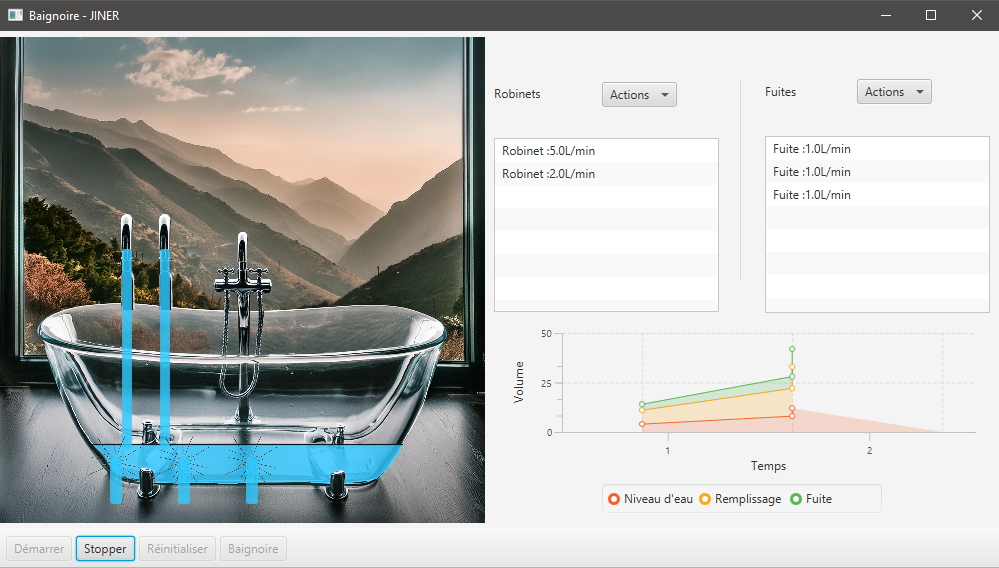

# Bienvenue sur le Projet POOA
## Introduction
Bienvenue dans l'application de simulation de remplissage de baignoire ! Cette application vous permet de simuler le remplissage d'une baignoire qui fuit, tout en surveillant divers paramètres tels que la quantité d'eau utilisée, la durée de remplissage, et plus encore. Vous pouvez ajuster les paramètres de simulation et observer les résultats graphiquement.

