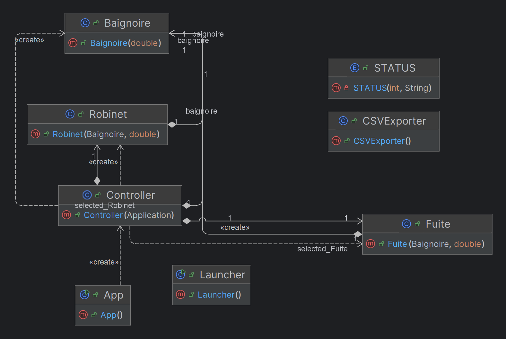
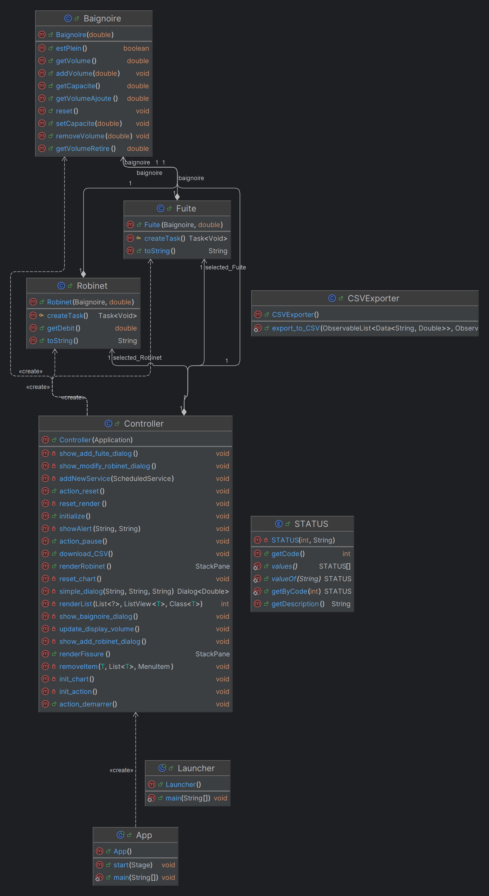
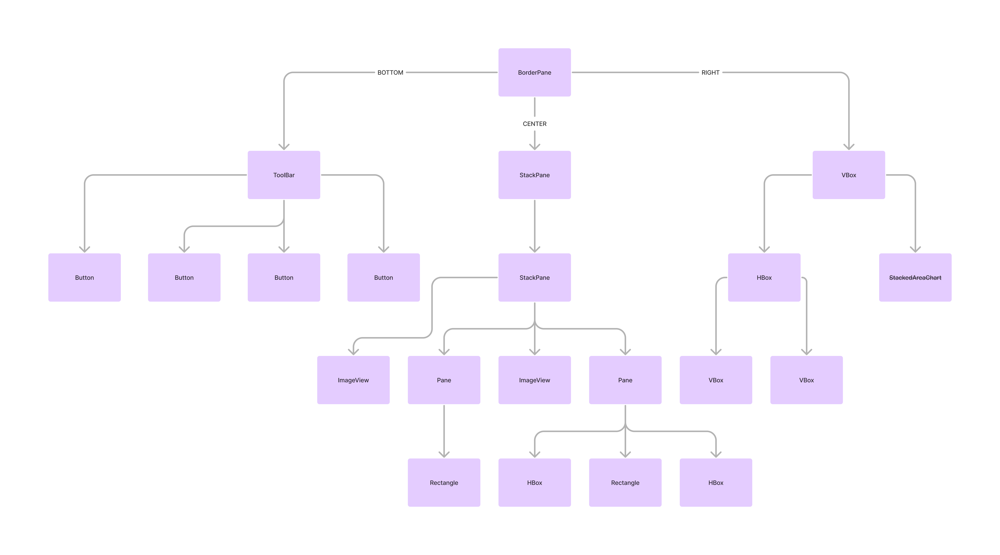

# Documentation Technique

## Installation

### Prérequis

- Java Development Kit (JDK) 22
- Maven

### Instructions d'Installation

1. Clonez ou téléchargez le projet depuis le dépôt GitHub.
2. Importez le projet dans votre IDE.
3. Assurez-vous que JavaFX est correctement configuré dans votre IDE.
4. Compilez et exécutez l'application.

## Structure du Projet

### Packages

- **ul.miage.jiner.model** : Contient les classes de modèle représentant les robinets, les fuites, et la baignoire.
- **ul.miage.jiner.controller** : Contient les classes contrôleur pour gérer les interactions utilisateur et la logique de simulation.

### Classes Principales



- **Launcher** : Classe principale qui lance l'application JavaFX.
- **Baignoire** : Classe représentant la baignoire avec des méthodes pour ajouter de l'eau, retirer de l'eau à cause des fuites, et vérifier le niveau d'eau.
- **Robinet** : Classe représentant un robinet avec des méthodes pour ajuster le débit.
- **Fuite** : Classe représentant une fuite avec des méthodes pour ajuster le débit de fuite.
- **Controller** : Classe contrôleur pour gérer les interactions de l'utilisateur et orchestrer la simulation.



### Les vues

Les différentes vues de l'application se trouvent dans le répertoire suivant : ```~/src/main/ressources/views```

On trouvera dans notre application la vue suivante :
- **app.fxml** : Vue principale de l'application.


### Multithreading

Chaque robinet et chaque fuite sont implémentés comme des threads autonomes pour simuler le remplissage et les fuites en parallèle. Utilisez la classe `ScheduledService<Void>` pour gérer ces processus.

Les robinets, les fuites ainsi que la mise à jour du diagramme sont des thread parrallélisés.


### Statuts de l'application

Une énuération nommé STATUS, nous permet de gérer les 5 status de l'application :

1. **WAITING** ("en attente") : Ce statut est utilisé lorsque l'application est dans l'attente d'une action utilisateur et hors d'un cycle de simulation.

2. **START** ("lancé") : Ce status est utilisé lorsque l'application est en cours de simulation.

3. **PAUSE** ("en pause") : Ce statut est utilisé lorsque la simulation a été mise en pause.

4. **RESET** ("reset") : Ce statut est utilisé lorsque l'application rretourne à ses paramètres d'origines.

5. **FINISHED** ("terminé") : Ce statut est utilisé lorqu'une simulation vient de se terminer.

### JavaFX

L'interface utilisateur est construite en utilisant JavaFX. 
Les fichiers FXML définissent la disposition, et les contrôleurs associés gèrent les interactions utilisateur.

### Sauvegarde des Résultats

À la fin de chaque simulation, les résultats sont sauvegardés dans un fichier CSV. 
La classe `CSVWriter` est utilisée pour écrire les données de simulation dans un format lisible par les tableurs.

## Fonctionnement 

Le fonctionnement de l'application est centré sur son **STATUT**. Elle est en permanence à l'écoute de tout changement de status et réagit en concéquence.

- **STATUT WAITING** : Il est possible d'effectuer toutes les modifications sur les paramètres de la simulation (ajout/modification/suppression de robinet, ajout/rebouchage de fuite, modificaton de la capacité de la baignoire)
L'utilisateur peut également lancer la simulation et réinitialiser l'application.

- **STATUT START** : Il est uniquement possible de modifier un robinet ou reboucher une fuite.
L'utilisateur peut également mettre en pause la simulation et réinitisalier l'application.

- **STATUT PAUSE** : Il est uniquement possible de modifier un robinet ou reboucher une fuite.
L'utilisateur peut également relancer la simulation et réinitisalier l'application.

- **STATUT RESET** : Il est uniquement possible de modifier la capacité de la baignoire. Après cette action effectuée, l'application passe sous le STATUT WAITING.

- **STATUT FINISH** : L'application se charge de remettre à zéro le volume de la baignoire. Après cette action effectuée, l'application passe sous le STATUT WAITING.

## Instructions de Développement

### Configuration du Développement

1. Assurez-vous d'avoir le JDK, JavaFX et Maven configurés dans votre environnement de développement.
2. Importez le projet dans votre IDE.

### Compilation et Exécution

Utilisez votre IDE pour compiler et exécuter le projet. Vous pouvez également utiliser Maven pour gérer les dépendances et le processus de build.

#### Compilation avec Maven

```bash
mvn clean compile
```

#### Exécution avec Maven

```bash
mvn javafx:run
```

### Contribution

Pour contribuer au projet, veuillez suivre ces étapes :

1. Fork le dépôt GitHub.
2. Créez une branche pour votre fonctionnalité (`git checkout -b feature/AmazingFeature`).
3. Commitez vos modifications (`git commit -m 'Add some amazing feature'`).
4. Poussez votre branche (`git push origin feature/AmazingFeature`).
5. Ouvrez une Pull Request.
