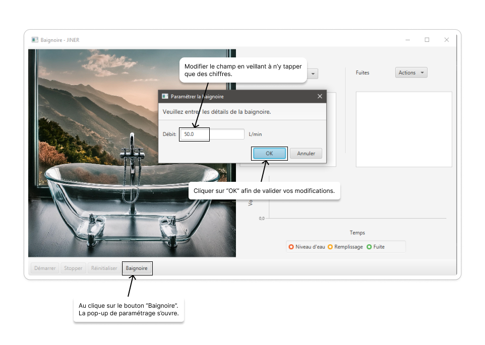
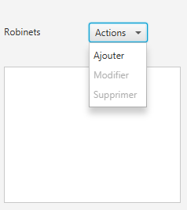
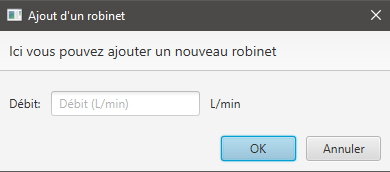
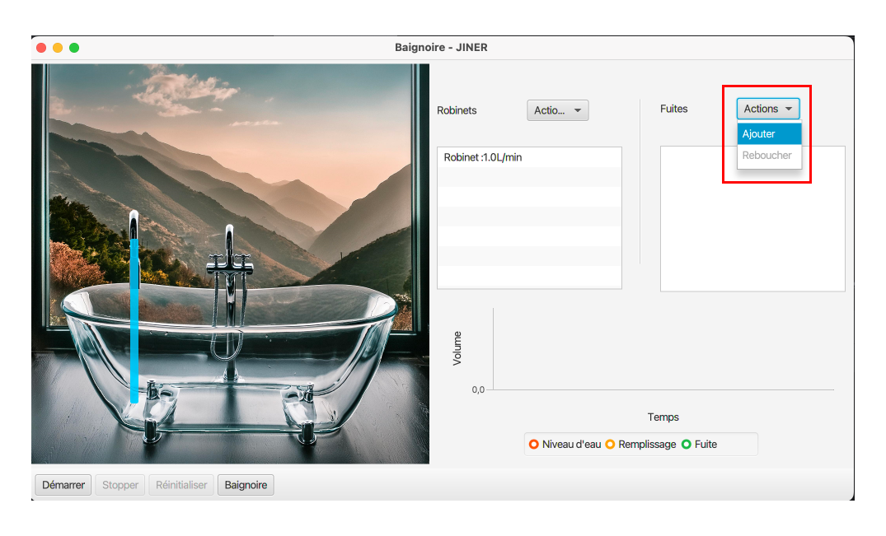
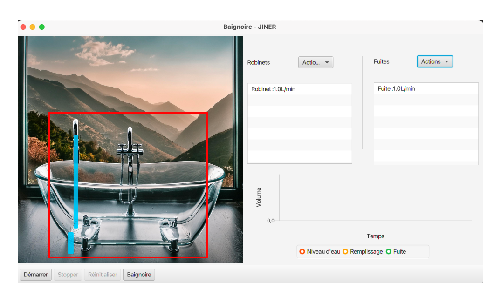
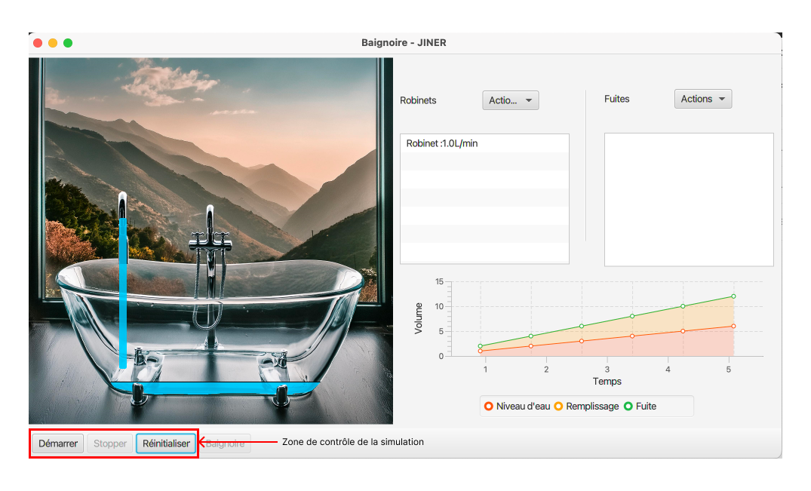
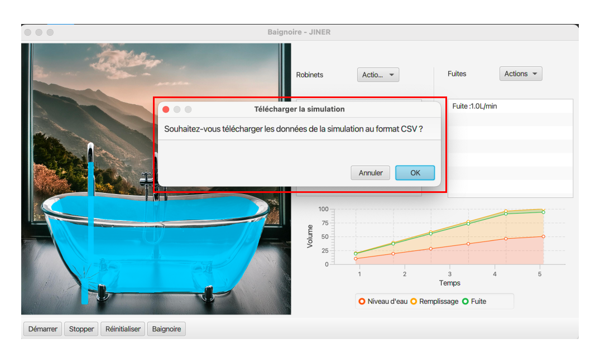

# Guide de l'Utilisateur

## Introduction

Bienvenue dans la partie utilisateur.

Ici vous trouverez l'ensemble des informations nécessaires pour pouvoir utiliser notre application.

## Prérequis

- Java 22
- (Optionel) IDE de votre choix

## Utilisation

### Lancement de l'Application
 
Plusieurs choix s'offrent à vous : 

- Le premier est d'aller double cliquer sur le fichier .jar
- Le second est de lancer le script de lancement de l'application

## Interface Utilisateur
L'interface de l'application se compose de plusieurs sections :

1. Paramètres de Simulation : Permet de configurer la capacité de la baignoire, le nombre de robinets, le débit de chaque robinet, le nombre de fuites, et le débit de chaque fuite.
2. Contrôle de Simulation : Boutons pour démarrer, arrêter, et réinitialiser la simulation.
3. Affichage Graphique : Visualisation en temps réel de la baignoire, des robinets, et des fuites.
4. Courbe de Remplissage : Graphique montrant l'évolution du niveau d'eau dans la baignoire au cours du temps.

## Configuration des Paramètres
Avant de démarrer la simulation, configurez les paramètres suivants dans la section "Paramètres de Simulation" :

- Capacité de la Baignoire : La capacité totale en litres.
- Nombre de Robinets : Le nombre de robinets disponibles pour remplir la baignoire.
- Débit de chaque Robinet : Le débit en litres par minute pour chaque robinet.
- Nombre de Fuites : Le nombre de fuites présentes dans la baignoire.
- Débit de chaque Fuite : Le débit en litres par minute pour chaque fuite.

### Modification de la capacité de la baignoire
La capacité de la baignoire est modifiable de cette manière à tout moment hors de l'execution de la simulation.

Lorsqu'une simulation arrive à terme cette même popup s'ouvre et vous invite au besoin à modifier à nouveau cette valeur.

**ATTENTION** : Il n'est pas possible d'ajouter un robinet en cours de simulation !

### Ajout / Modification / Suppression d'un robinet

Ces trois actions se font à partir du petit menu déroulant à côté du champ "Robinets".

L'ajout d'un robinet ouvre une boite de dialog comme celle ci :

Il en est de même pour la modification, il faut néanmoins avoir au préalable séléctionné 
un robinet de la liste.

Pour la suppression, il suffit de séléctionner un robinet et de cliquer sur le bouton du menu correspondant.

## Gestion des fuites

### Ajout d'une fuite

Pour ajouter une fuite, il suffit de cliquer sur le bouton **Ajouter** dans le menu Déroulant près de "Fuites". Une boite de dialogue s'ouvre et vous invite à renseigner le débit de la fuite.

### Rebouchage d'une fuite

## Contrôle de la Simulation

La section "Contrôle de Simulation" contient trois boutons :

- Démarrer : Lance la simulation avec les paramètres configurés.
- Stopper : Met en pause la simulation.
- Réinitialiser : Réinitialise tous les paramètres et le niveau d'eau dans la baignoire.

### Démarrer la simulation 
- Pour pouvoir démarrer la simulation, il faut avoir paramètrer au moins un robinet.
Le bouton **démarrer** se dégrise et il est maintenant permis de lancer une simulation

### Arrêter la simulation
- Une fois la simulation lancer il est possible de la mettre en pause.
- Appuyer une nouvelle fois sur le bouton **démarrer** permet de relancet la simulation

### Réinitialiser la simulation
- L'entièreté des paramètres sont remis à zéro.

## Visualisation et Exportation

Pendant la simulation, vous pouvez observer l'évolution du niveau d'eau en temps réel. À la fin de chaque simulation, un fichier CSV est généré pour visualiser la courbe de remplissage.

A la fin de chaque simulation, il vous ait proposé de récupérer un fichier CSV est généré pour visualiser la courbe de remplissage.

